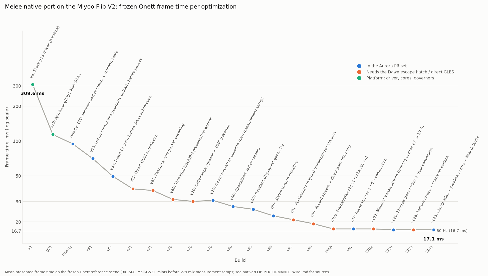

<div align="center">
  
</div>
<br/>

## Aurora for ARM and draw-call-constrained GPUs

This fork of [encounter/aurora](https://github.com/encounter/aurora) carries the renderer work that took
the native [Melee port](https://github.com/sh1ftmaker/melee-native-miyoo-flip) on a Miyoo Flip V2 (RK3566:
four Cortex-A55, Mali-G52 through a GLES-only driver, 1 GiB) from 3 FPS to a steady 58-59 FPS. The
target is every cheap ARM device that runs Aurora titles poorly today: handheld emulation devices,
Raspberry Pi class boards, weaker phones, and anything else where the driver's per-draw and per-pass
CPU cost, not the GPU, sets the frame time. Everything is opt-in through `AuroraConfig`; with the flags
off the renderer is byte-identical to upstream.



The chart (`docs/perf/onett-frame-time.csv`, `docs/perf/plot_onett_frame_time.py`) is the port's frozen
Onett reference scene, mean presented frame time per build. Blue points are changes that live in this
repository and are being proposed upstream as separate pull requests; orange points need the OpenGL ES
fast path (which needs the `gl-native-interop` branch of
[zalo/dawn-aurora-arm](https://github.com/zalo/dawn-aurora-arm)); green points are device/driver setup
in the port. Every change and its measured impact is listed in the port's
[`native/FLIP_PERFORMANCE_WINS.md`](https://github.com/sh1ftmaker/melee-native-miyoo-flip/blob/miyoo-flip/native/FLIP_PERFORMANCE_WINS.md).

What is in this branch, bottom up:

| Layer | Branches (each also a standalone PR) | What it does |
| --- | --- | --- |
| GX translation | `perf/gx-cpu-vertex-decode` (= `perf/gx-vertex-loaders` + `perf/gx-resident-display-lists` + `perf/gx-instanced-point-sprites`) | Specialized CPU vertex loaders writing conventional vertex inputs (the only vertex path that works on GPUs with zero vertex-stage storage buffers: WebGPU compatibility mode, Mali GLES), display-list geometry decoded once and kept resident, one record per point sprite |
| GX translation | `perf/gx-pipeline-state-memo`, `perf/gx-stable-texture-identity` | Skip config/shader rebuilds for unchanged state; texture identity from the image description with periodic verification |
| Frame structure | `perf/async-frames`, `perf/gfx-pass-fusion`, `perf/skip-empty-imgui-pass` | Game thread never joins the FIFO worker; adjacent small render-to-texture passes fused; one pass fewer |
| Binding | `perf/gfx-texture-arrays` | GX textures as layers of shared 2D arrays (plus an opt-in atlas), fewer bind-group switches |
| Fast path | `gles-direct-submission` (this branch) | Uniform table with adjacent-draw batching (halves draw calls, WebGPU path too), OpenGL ES direct submission of GX passes through Dawn's native GL interop, persistently mapped streams, scene rendered on the presented surface, optional half-resolution sprites and small-copy-pass interval. See [docs/gles-direct.md](docs/gles-direct.md). |
| Platform | `integration/flip-prs-platform` | The Miyoo Flip's EGL/GBM surface, device limits and pool sizes (`MELEE_MIYOO_FLIP`) |

Measured on the Flip, frozen Onett: upstream Aurora does not start (its vertex path needs two
vertex-stage storage buffers, the Mali driver exposes none); the PR set alone through Dawn's GL
backend runs at 18.6-19.5 FPS; the PR set plus the fast path at 58-59 FPS with a byte-identical frame.

### Using these optimizations in a port

1. **Build against this branch** (`AURORA_GLES_DIRECT=ON` is the default). For the direct path, build
   Dawn from `zalo/dawn-aurora-arm` branch `gl-native-interop` and point
   `AURORA_GLES_DIRECT_DAWN_INCLUDE_DIR` at its headers (or pass the install through `Dawn_DIR`);
   against stock Dawn the direct path compiles to a stub and the rest still works.
2. **Turn the translation-side features on** in the `AuroraConfig` you pass to `aurora_initialize`:
   ```c
   config.cpuVertexDecode = true;        // required on GLES-class GPUs; exact
   config.residentDisplayLists = true;   // see step 3; exact
   config.residentGeometryBudget = 64u << 20;
   config.asyncFrames = true;            // frame = max(game, FIFO, render) instead of the sum
   config.textureVerifyInterval = 4;     // re-verify sampled texture content every 4 frames
   config.textureAtlas = true;           // optional, +-1 on a few hundred pixels
   // pipeline-state memo, stable texture identities, texture arrays, pass fusion and the
   // ImGui-pass skip are always on; disableRenderPassFusion opts out of fusion.
   ```
   On GPUs with a real Vulkan/Metal/D3D driver these alone recover most of the translation cost;
   on GLES-only devices continue with step 4.
3. **Release resident geometry when the game frees it.** `residentDisplayLists` keeps
   `GXCallDisplayList` geometry on the GPU keyed by the list and array pointers; call
   `GXInvalidateResidentGeometry(base, size)` (declared in `dolphin/gx/GXAurora.h`) before the title
   frees or rewrites memory that held display lists or the vertex arrays they index (in Melee: the
   heap free and archive unload paths). Lists rewritten in place are detected by a hash of their
   head and tail, arrays are not, so skip this feature for titles that mutate vertex arrays in place
   without releasing them.
4. **Enable the OpenGL ES fast path** on devices without Vulkan:
   ```c
   config.uniformTable = true;           // exact; also helps the WebGPU path
   config.batchDraws = true;             // exact
   config.glesDirectSubmission = 0;      // 0 = automatic when the GL backend and interop are present
   config.glesMappedStreams = 0;         // 0 = automatic with direct submission
   config.sceneOnSurface = true;         // one pass fewer per frame
   // quality trade-offs, off by default: halfResolutionSpritePoints, smallCopyPassInterval, sortOpaqueDraws
   ```
   Ineligible passes (custom draws, RmlUi, ImGui, MSAA) fall back to the WebGPU path; a frame is never
   partially intercepted. Set `renderStats = true` for the `[gx-batch]`, `[gles-direct-*]` and
   `[render-phase]` diagnostics and the `aurora_render_stats_*` counters.
5. **Give every renderer variant its own pipeline cache directory.** Pipeline configs cached by a
   build with `cpuVertexDecode` off decode to storage-buffer shaders that fail to link on Mali, and
   vice versa.
6. **Check exactness the way the port did:** capture the EFB of a frozen scene with and without each
   flag and compare pixels. All features marked exact above produced byte-identical captures on the
   Flip; the atlas, half-resolution sprites, the copy interval and the opaque sort did not and are off
   unless a title opts in.

Mali/Adreno driver rules learned on the way (any per-draw uniform change costs as much as the draw,
never write into a buffer the GPU may still read, one render pass costs ~0.5-0.7 ms of driver time)
are in `docs/gles-direct.md` and the port's `FLIP_PERFORMANCE_WINS.md`.

---

Aurora is a source-level GameCube & Wii compatibility layer intended for use with game decompilation projects.

Originally developed for use in [Metaforce](https://github.com/AxioDL/metaforce), a Metroid Prime reverse engineering project.
It now powers several completed source ports, including [Dusklight](https://github.com/TwilitRealm/dusklight).

### Features

- Application layer using SDL3
  - Runs on Windows, Linux, macOS, iOS, tvOS, Android
- GX compatibility layer
  - Graphics API support: D3D12, Vulkan, Metal, and OpenGL ES through Dawn's GL backend with an optional direct-submission fast path (this fork)
  - Highly accurate and performant GX implementation
  - Robust pipeline cache system with "transferable" cache support for releases
  - Dolphin-compatible texture pack support
  - Widescreen & resolution scaling support
  - Custom APIs for offscreen rendering
- PAD compatibility layer
  - Utilizes `SDL_Gamepad` for wide controller support, including GameCube controller adapters
  - Automatically saves and loads controller bindings and port mappings
  - Gyro & mouse support
- DVD compatibility layer
  - Utilizes [nod](https://github.com/encounter/nod) to support all GameCube/Wii disc image types, including RVZ
- CARD compatibility layer
  - Full compatibility with Dolphin `.gci` and `.raw` for game saves
- [Dear ImGui](https://github.com/ocornut/imgui) built-in for simple debug UIs
- [RmlUi](https://github.com/mikke89/RmlUi) built-in for full-fledged HTML/CSS-based UIs

### Graphics

The GX compatibility layer is built on top of [WebGPU](https://www.w3.org/TR/webgpu/), a cross-platform graphics API
abstraction layer. WebGPU allows targeting all major platforms simultaneously with minimal overhead. The WebGPU
implementation used is Chromium's [Dawn](https://dawn.googlesource.com/dawn/).


### Building

See [docs/building.md](docs/building.md) for build instructions, CMake integration, and configuration options.

### License

Aurora is licensed under the [MIT License](LICENSE).
